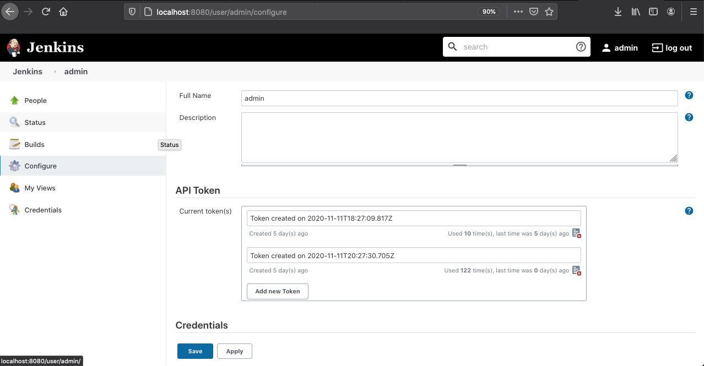

# Jengo

## How to Install it
### MacOS
```
brew tap tomkennes/homebrew-jengo

brew install jengo
```


## How To Use it

### Step 0. - Run a local Jenkins Server
If you already have a Jenkins Server, continue with the next step. If you are looking to deploy a more production-worthy Jenkins server, consult the Jenkins documentation.

Shortest option:

```bash
docker pull jenkins/jenkins

docker run -p 8080:8080 -p 50000:50000 -v jenkins_home:/var/jenkins_home jenkins/jenkins:lts
```

Short option: https://medium.com/@YetkinTimocin/creating-a-local-jenkins-server-using-docker-2e4dfe7b5880


Long option: https://www.jenkins.io/doc/book/installing/docker/

### Step 1. Create an API Token
If you have sufficient rights, you should be able to create a token at the url suffix: /user/<username>/configure.

See also the screenshot below:


### Step 1. Create a configuraiton file
Name it: 
```
~/.jenkins.yaml
```
Fill it:
```yaml
current: localhost
contexts: 
 - name: localhost
   url: "http://localhost:8080"
   username: "admin"
   token:    "<token>"
```

In the future, I might add options for more customization with regard to the contexts, as well as making use of multiple contexts. Currently, this is not of direct use for my own projects, so I am postponing this. 

Contributions are as always much appreciated!

#### Step 2. 
The commands should be working now!

Give it a try:
```
jengo jobs
```

```
jengo builds --job <job-name>
```
